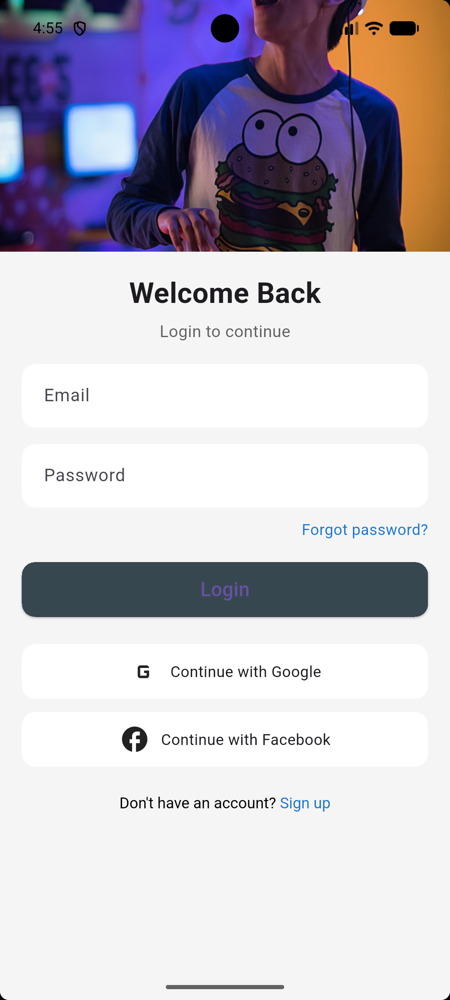
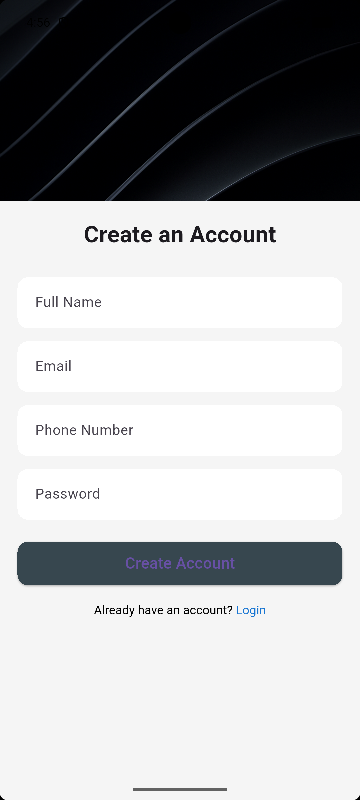
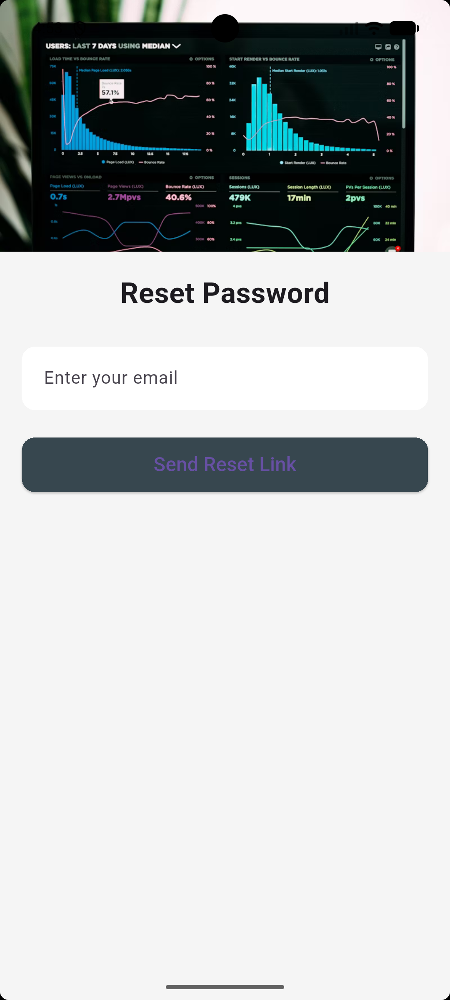

Chunne's Flutter Project

A clean and modern Flutter authentication UI that includes Login, Signup, and Forgot Password pages.  
The app uses a light and clean design, smooth navigation, and reusable UI components — perfect as a starter template for authentication systems.

 
Authentication Screens**
- Modern Login Page with:
    - Email input
    - Password input (obscured)
    - “Forgot Password” link
    - Social sign-in buttons (Google & Facebook placeholders)
    - Smooth navigation to Signup

- Clean Signup Page with:
    - Full Name field
    - Email field
    - Phone Number field
    - Password field
    - Create Account button
    - Navigation back to Login

- Simple Forgot Password Page with:
    - Email input field
    - “Send Reset Link” button
    - Banner graphic header

UI & Design
- Light & clean modern UI style
- Banner image header for all screens
- Rounded input fields with custom `InputDecorationTheme`
- Consistent button styles
- Smooth navigation between pages
- Fully scrollable layouts for small screens

Technical Features
- Built with Flutter (Dart)
- Reusable social button widget
- Custom theme using:
    - `primarySwatch`
    - Global `inputDecorationTheme`
    - Custom scaffold background
- Responsive layout with `SingleChildScrollView`
- Clean code architecture

---
# 1. Login Screen

# 2. Sign Up Screen

# 3. Forgotten Password Screen

